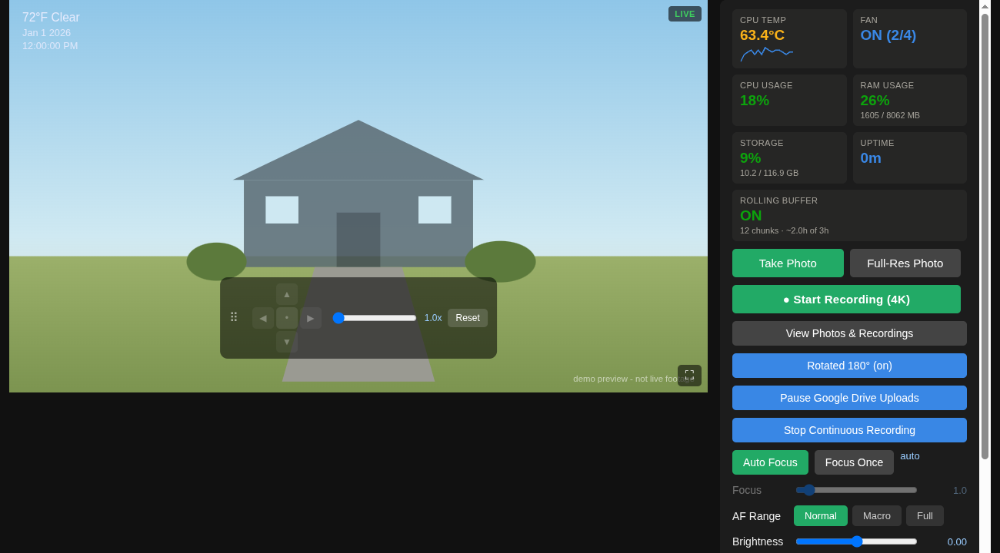

# Hawkeye Camera



## About Hawkeye Camera

Hawkeye Camera turns a Raspberry Pi 5 or 4 into a self-hosted camera system:
a live MJPEG stream, on-demand snapshots and recordings, an always-on rolling
video buffer, and automatic Google Drive backup. Everything runs as a
systemd user service - no cloud subscription, no third-party app required to
view the feed.

**Features**:
- Live stream viewable from any browser on your network, with pan/zoom/focus/rotate controls
- Full-resolution stills on demand, independent of the live-view resolution
- On-demand manual recordings (4K) alongside an always-on rolling buffer (720p) for after-the-fact review
- Automatic background upload of snapshots/recordings/continuous footage to Google Drive - fully optional, pausable/resumable from the UI, with backed-up files browsable and deletable from the app
- Live weather overlay on the video feed
- Runs unattended as a systemd user service with lingering enabled - survives reboot and logout with no login required
- Optional HTTP Basic Auth on the stream and web UI - open on your LAN by default, lockable with a username/password

**Optional integrations**:
- Google Drive backup (OAuth device-flow authorization, resumable uploads)
- Weather overlay for your location
- HTTP Basic Auth login (see [Authentication](./SETUP.md#authentication-optional) in SETUP.md)

See [SETUP.md](./SETUP.md) for full configuration details on each.

## Hardware

- Raspberry Pi 5 or 4 (Model B, 4GB+ RAM)
    - Pi 5 has no hardware H.264 encoder - 4K recording is software-encoded and CPU-heavier than Pi 4
    - Also runs on a **Raspberry Pi Zero 2 W** (64-bit-capable, unlike the older non-"2" Zero/Zero W) with a reduced-resolution config - see [Low-Power Boards](./SETUP.md#low-power-boards-raspberry-pi-zero-2-w) in SETUP.md
- Official power supply (Pi 5: 27W USB-C PD; Pi 4: 5V/3A USB-C)
- MicroSD card, 32GB+ (A2/U3 rated), or a USB SSD/NVMe boot drive
- A CSI camera module
    - Built and tested against an **Arducam 64MP Hawkeye** (autofocus)
    - Should also work unmodified with the **Raspberry Pi Camera Module 3** (confirmed by code inspection, not yet on physical hardware) - the app reads resolution/AF range/crop limits from the sensor at runtime. See [Camera Compatibility](./SETUP.md#camera-compatibility-switching-away-from-the-arducam-64mp) in SETUP.md for the one required config change and what differs (autofocus support, max-zoom quality) across camera modules
- CSI ribbon cable matching your Pi's connector (Pi 5's connector differs from Pi 4's)
- Active cooling (strongly recommended, especially on Pi 5 - expect 55-65°C+ under continuous recording load)
- A case with an unobstructed camera mount

See [SETUP.md](./SETUP.md) for the full hardware rationale and a step-by-step build guide.

## Installation

To install Hawkeye Camera, follow these steps:

1. Clone the repository:
    ```bash
    git clone https://github.com/Rajesh6174/RaspberryPi5HawkeyeCameraApp.git ~/.local/share/camera-stream
    ```
2. Navigate to the project directory:
    ```bash
    cd ~/.local/share/camera-stream
    ```
3. Run the installation script:
    ```bash
    ./install.sh
    ```

The script installs all required apt packages (`python3-picamera2`, `libcamera`,
`ffmpeg`, etc.), enables the camera interface, creates the data directories,
sets up `~/.config/camera-stream/` from the provided templates, and installs +
starts the systemd service.

After installation, if you're using the Arducam 64MP the script prints one
extra command to add its device-tree overlay - run it, then reboot. Once
rebooted, the live stream is available at `http://<pi-ip>:8000/`.

For the full walkthrough - including OS flashing, camera verification, and
filling in optional secrets (Google Drive) - see
[SETUP.md](./SETUP.md).

## Update

To update Hawkeye Camera with the latest code changes:

1. Navigate to the project directory:
    ```bash
    cd ~/.local/share/camera-stream
    ```
2. Fetch the latest changes:
    ```bash
    git pull
    ```
3. Restart the service:
    ```bash
    systemctl --user restart camera-stream.service
    ```

## Uninstall

```bash
systemctl --user disable --now camera-stream.service
rm ~/.config/systemd/user/camera-stream.service
systemctl --user daemon-reload
rm -rf ~/.local/share/camera-stream ~/.config/camera-stream
```

## Disaster Recovery

If the SD card dies, a fresh Pi can be back up in minutes rather than
starting from scratch - see the [Disaster Recovery](./SETUP.md#disaster-recovery-sd-card-corrupts-get-back-up-fast)
section of SETUP.md.

## License

Distributed under the MIT License, see [LICENSE](./LICENSE) for more information.

## Issues

Check [SETUP.md](./SETUP.md) for setup/hardware troubleshooting. For anything
else, open an issue on the
[GitHub Issues](https://github.com/Rajesh6174/RaspberryPi5HawkeyeCameraApp/issues) page.

## Acknowledgements

Built on top of these projects:

- [picamera2](https://github.com/raspberrypi/picamera2) - the camera library this app is built around
- [libcamera](https://libcamera.org/) - the underlying camera stack on Raspberry Pi OS
- [rpicam-apps](https://github.com/raspberrypi/rpicam-apps) - reference camera applications used for testing/calibration
