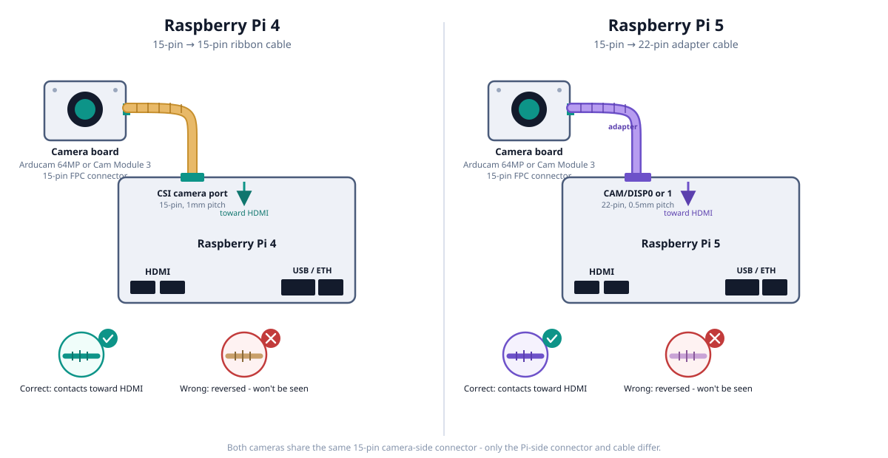
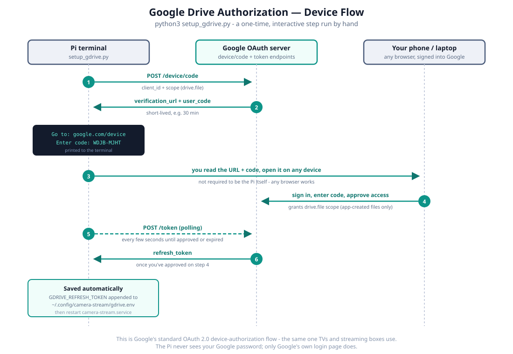
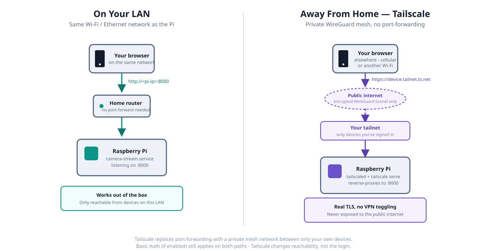

# Setup Guide

Everything needed to go from a blank SD card to a running camera stream,
on either a Raspberry Pi 5 or Pi 4.

## Hardware required

| Item | Notes |
|---|---|
| Raspberry Pi 5 or Pi 4 (Model B, 4GB+ RAM) | Pi 5 has no hardware H.264 encoder - `server.py` encodes 4K in software, which is noticeably heavier on CPU than Pi 4. Either works; Pi 5 just runs hotter under recording load. |
| Official power supply | Pi 5: 27W USB-C PD (5V/5A). Pi 4: 5V/3A USB-C. Undersized supplies cause random reboots/throttling under load, especially while recording. |
| microSD card, 32GB+ (A2/U3 rated) | Or boot from USB SSD/NVMe (Pi 5 supports PCIe natively) - recommended if you'll keep the continuous buffer's retention window long, since that's ~1GB/hour at the default bitrate. |
| Camera module | This app was built against an **Arducam 64MP Hawkeye** (autofocus, CSI), but the code is sensor-agnostic - see [Camera Compatibility](#camera-compatibility-switching-away-from-the-arducam-64mp) below for what does and doesn't change if you use a different one. |
| CSI ribbon cable | Comes with the camera module; make sure it matches your Pi's CSI connector (Pi 5's is a different connector pitch than Pi 4's - use the cable rated for your Pi model). See [Connecting the camera](#connecting-the-camera-cable-and-orientation) below for exact cable types and a connection diagram. |
| Cooling | Active cooling strongly recommended, especially Pi 5. CPU sits around 55-65°C under normal continuous-recording load in testing here; a passive heatsink alone will let it climb further and throttle. Official Active Cooler (Pi 5) or a case with a fan (Pi 4) is enough. |
| Case with camera mount | Any case that exposes the CSI connector and gives the camera an unobstructed view of what you're monitoring. |
| Network | Ethernet recommended for the live stream/uploads; Wi-Fi works fine too. |

For a broader reference beyond this app's specific supported hardware - other
official/Arducam camera models, Touch Displays, PCIe/NVMe, full port specs -
see [docs/hardware-reference.md](./docs/hardware-reference.md). Everything on
*this* page stays scoped to exactly what the app supports and has been
verified against running hardware.

## 1. Flash the OS

1. Download [Raspberry Pi Imager](https://www.raspberrypi.com/software/).
2. Choose **Raspberry Pi OS (64-bit)** - this app requires 64-bit for `picamera2`/`libcamera`.
3. In Imager's settings (gear icon / Ctrl+Shift+X) before writing:
   - Set hostname, enable SSH, set username/password, configure Wi-Fi if needed.
   - This gives you headless SSH access on first boot - no monitor/keyboard needed.
4. Write to the SD card, insert it in the Pi, power on.
5. `ssh <username>@<hostname>.local` (or the DHCP-assigned IP) once it boots.

## 2. Clone this repo and run the installer

```bash
sudo apt-get update && sudo apt-get install -y git
git clone https://github.com/Rajesh6174/RaspberryPi5HawkeyeCameraApp.git ~/.local/share/camera-stream
cd ~/.local/share/camera-stream
./install.sh
```

`install.sh` is idempotent and handles:
- Installing all required apt packages (`python3-picamera2`, `libcamera`, `ffmpeg`, etc. - see table below).
- Adding `camera_auto_detect=1` to the boot config if missing, and printing the extra
  line needed if you're using the Arducam 64MP.
- Creating `snapshots/`, `recordings/`, `continuous/` data directories.
- Creating `~/.config/camera-stream/` and populating it with `.env` files from the
  `config/*.env.example` templates (placeholders only - you fill in real values, see step 4).
- Installing the systemd user units from `systemd/`, enabling lingering (so services
  survive logout/reboot with no login), and starting `camera-stream.service`.

### What gets installed, if you want to do it by hand instead

```bash
sudo apt-get install -y \
    python3-picamera2 python3-libcamera rpicam-apps \
    python3-requests python3-pil python3-numpy python3-psutil \
    ffmpeg
```

Debian/Raspberry Pi OS marks the system Python as "externally managed" (PEP 668) -
these packages are installed via `apt`, not `pip`. Don't `pip install` them; there's no
requirements.txt for this reason.

## 3. Enable the camera and reboot

### Connecting the camera: cable and orientation

Both the Arducam 64MP Hawkeye and the official Camera Module 3 use the same
15-pin FPC connector on the camera board itself - the cable you need depends
only on which Pi you're connecting to, not which camera you bought:



- **Raspberry Pi 4** has one CSI camera port: 15-pin, 1mm pitch, 2-lane MIPI
  CSI-2. Use the standard 15-pin-to-15-pin ribbon cable - the one that ships
  in the box with both the Arducam 64MP Hawkeye and Camera Module 3.
- **Raspberry Pi 5** has two CSI/DISP ports (`CAM/DISP0` and `CAM/DISP1`, on
  opposite sides of the board, natively 4-lane) - either works for a single
  camera, and it defaults to `CAM/DISP1` if you don't specify one (see the
  troubleshooting note below to force `CAM/DISP0` instead). They're 22-pin,
  0.5mm pitch - a physically different, smaller connector than Pi 4's. You
  need a **15-pin-to-22-pin adapter cable**:
    - The Arducam 64MP Hawkeye ships with this cable in the box alongside the
      standard one - no separate purchase needed.
    - Camera Module 3's standard (non-wide-angle) variant also now ships with
      both cables. **The wide-angle variant does not** - if you bought that
      one, you'll need a 15-pin-to-22-pin FPC camera cable separately (search
      that exact term; widely stocked by Pi accessory retailers).
    - Since the camera itself only has a 15-pin (2-lane) connector, this
      adapter runs at 2 lanes even on Pi 5's 4-lane-capable port - a non-issue
      for this app's resolutions, just don't expect the adapter to unlock
      extra bandwidth the camera doesn't have.

**Orientation - the official, always-correct way to think about it**: open
the port's plastic locking flap by gently pulling it up, insert the cable
with the metallic contacts facing *away from the flap*, then push the flap
back down until it clicks. That instruction is identical on every Raspberry
Pi board (this is the Raspberry Pi Foundation's own phrasing), so it's the
one to trust if the board-relative description below ever feels ambiguous.

As a visual double-check once the cable's in: on **Pi 4**, contacts end up
facing the **HDMI side**; on **Pi 5**, they end up facing the **USB/Ethernet
side instead - the mirror image of Pi 4**, not the same direction. It's an
easy assumption to carry over by habit if you've set up a Pi 4 before, so
worth confirming explicitly on a Pi 5 build. Either way, if it's in backwards
the camera simply won't be detected - reversing an FPC cable doesn't damage
anything, so there's no risk in checking by trial.

**Troubleshooting: camera not detected on Pi 5.** If nothing shows up in
`rpicam-hello --list-cameras`, double check you plugged into the port your
overlay expects - Pi 5 defaults to `CAM/DISP1` when the dtoverlay doesn't
specify otherwise. To force the other port, append `,cam0` to the overlay
line, e.g. `dtoverlay=arducam-64mp,cam0` in `/boot/firmware/config.txt`, then
reboot.

For the **Arducam 64MP** (this project's default):
```bash
echo 'dtoverlay=arducam-64mp' | sudo tee -a /boot/firmware/config.txt
sudo reboot
```

For an **official Camera Module** (v2/v3/HQ), `camera_auto_detect=1` (already added by
`install.sh`) is sufficient - no extra overlay line, just reboot.

After reboot, confirm the camera is detected:
```bash
rpicam-hello --list-cameras
```
You should see your camera model and its supported resolutions listed.

### Camera Compatibility: switching away from the Arducam 64MP

**No code changes needed.** `server.py` never hardcodes anything about the Arducam
sensor - resolution, autofocus lens-position range, and digital zoom/crop limits are
all read at startup from the sensor itself:

```python
FULL_RES_SIZE = picam2.camera_properties["PixelArraySize"]      # native resolution
LENS_MIN, LENS_MAX, LENS_DEFAULT = CONTROL_RANGES["LensPosition"]  # AF range
FULL_CROP = picam2.camera_properties["ScalerCropMaximum"]       # zoom/pan limits
```

Swap the camera module and these adapt automatically. Confirmed by code inspection
against a **Raspberry Pi Camera Module 3** (no hardcoded Arducam resolutions or
model-specific branches anywhere in `server.py`) - not yet tested on physical
Camera Module 3 hardware, so treat this as "should work," and open an issue if it
doesn't.

**One config change is required, though** - `/boot/firmware/config.txt`:
```
dtoverlay=arducam-64mp   # <- comment this out or delete when using a different camera
```
That overlay is Arducam-specific. Left in place, it prevents `camera_auto_detect=1`
from correctly identifying a different camera. Comment it out (or delete it), reboot,
and `camera_auto_detect=1` alone handles official Camera Modules (v2/v3/HQ) and most
other libcamera-supported CSI cameras.

**Autofocus support depends on the camera, not the code:**
- **Camera Module 3** has electronic autofocus (IMX708, PDAF) - `LensPosition`,
  `AfRange` (normal/macro/full), and the pre-capture autofocus pass in
  `_autofocus_before_capture()` all work exactly as they do on the Arducam 64MP.
- **Camera Module v2** (fixed focus) and the **HQ Camera** (manual focus ring, no
  motorized lens) have no `LensPosition` control at all. `picam2.camera_controls`
  simply won't include it, and the AF-related UI controls/endpoints will error if
  used - stick to the default framing on these.

**Expect a quality difference at high zoom, not a malfunction.** `ZOOM_MAX = 8.0` is
a fixed multiplier applied to whatever `ScalerCropMaximum` the sensor reports. On the
64MP Arducam that still leaves a large pixel crop at 8x; on a lower-resolution sensor
(e.g. Camera Module 3's 11.9MP/4608x2592) the same 8x crop is proportionally smaller
in absolute pixels, so maximum zoom will look softer. Everything still functions -
it's a resolution trade-off, not a bug.

## 4. Fill in the config files (the part that can't be automated)

None of these are in git, on purpose - they hold real credentials/secrets, and
`.gitignore` excludes any `*.env` file except the `.example` templates. `install.sh`
creates `~/.config/camera-stream/{gdrive,location,performance,auth}.env` from those
templates (everything in them commented out, so they're inert until you edit them) -
edit them directly, or see below for a faster recovery path.

| File | Required? | What it's for |
|---|---|---|
| `gdrive.env` | Optional | Google Drive backup of snapshots/recordings/continuous buffer. Run `python3 setup_gdrive.py` once - it walks you through Google's device-authorization flow (a URL + code to approve on your phone) and writes `GDRIVE_REFRESH_TOKEN` automatically. Needs `GDRIVE_CLIENT_ID`/`GDRIVE_CLIENT_SECRET` from Google Cloud Console first (OAuth client type "TVs and Limited Input devices"). Entirely optional - without this file the app runs identically, it just skips backup. Once configured, uploading can be paused/resumed anytime from the web UI ("Pause/Resume Google Drive Uploads"), and backed-up files can be browsed and deleted straight from Drive via the "Drive Backups" tab in the gallery - no need to open Drive separately. |
| `location.env` | Optional | Deploy-time default lat/lon for the weather overlay. Without it, defaults to 0,0. Can also be changed anytime from the web UI ("Set Weather Location") without touching this file or restarting - that live value is stored in `location_state.json` and takes precedence once set. |
| `performance.env` | Optional | Resolution/bitrate/buffer overrides. Without it, the original fixed Pi 4/5-tuned values apply. Needed on low-RAM boards - see [Low-Power Boards](#low-power-boards-raspberry-pi-zero-2-w). |
| `auth.env` | Optional | `CAMERA_USER`/`CAMERA_PASS` for HTTP Basic Auth on the stream and web UI. Without it (or with either value empty), the server stays open on your LAN with no login - this app's original behavior. See [Authentication](#authentication-optional) below. |

### Google Drive authorization, visualized

`setup_gdrive.py`'s device-authorization flow (referenced in the table above) is a
CLI prompt, not a web page, so it's easy to be unsure what's actually happening
behind "go to this URL, enter this code." It's Google's standard OAuth 2.0
device-authorization flow - the same one TVs and streaming boxes use - and the Pi
never sees your Google password, only Google's own login page does:



Restart the service after editing any of these:
```bash
systemctl --user restart camera-stream.service
```

## 5. Verify it's running

```bash
systemctl --user status camera-stream.service --no-pager
curl -s http://127.0.0.1:8000/api/sysinfo | python3 -m json.tool
```

Then open `http://<pi-ip>:8000/` in a browser for the live view.

## Authentication (optional)

By default, the stream and web UI are wide open to anyone on your LAN - no login.
To require one:
```bash
cp ~/.local/share/camera-stream/config/auth.env.example ~/.config/camera-stream/auth.env
nano ~/.config/camera-stream/auth.env   # set CAMERA_USER / CAMERA_PASS
chmod 600 ~/.config/camera-stream/auth.env
systemctl --user restart camera-stream.service
```
Every route is protected (the web UI, the `/api/*` endpoints, and `/stream.mjpg`) via
HTTP Basic Auth - your browser will prompt for the username/password once, then
cache and resend them automatically for the rest of the page's requests.

**In VLC**, embed the credentials directly in the URL instead of relying on a prompt:
```
Media -> Open Network Stream -> http://username:password@<pi-ip>:8000/stream.mjpg
```

Leave the file absent, or either value empty, to keep the server open with no login -
same as before this feature existed.

**Security scope, so expectations are accurate**: this is Basic Auth over plain
HTTP (there's no TLS anywhere in this app). It's enough to keep casual users on
your LAN out, but credentials travel base64-encoded, not encrypted, so don't reuse
a sensitive password here. This absolutely does not make it safe to port-forward
port 8000 to the public internet - for that, put a reverse proxy with real HTTPS in
front of it instead.

## Remote Access via Tailscale (optional)

For reaching the camera from outside your LAN - checking it from your phone
while away from home - without port-forwarding anything on your router.
[Tailscale](https://tailscale.com/) creates a private WireGuard mesh network
between your own devices; this exposes the app only to devices signed into
your tailnet, never the public internet.



```bash
# 1. Install (skip if already installed - check with `which tailscale`)
curl -fsSL https://tailscale.com/install.sh | sh

# 2. Log in - prints a URL, open it on any device to approve this Pi
sudo tailscale up

# 3. One-time: let your own account run tailscale commands without sudo
sudo tailscale set --operator=$USER

# 4. Enable Serve on your tailnet if this is the first time using it -
#    running this will print an admin-console approval link if needed
tailscale serve --bg 8000
```

That last command prints a private URL in the form
`https://<device-name>.<tailnet-name>.ts.net/` - open it from any device
signed into the same tailnet (install the Tailscale app there too) and it
behaves like any normal HTTPS site, no VPN toggling needed. The certificate
is real (Tailscale provisions it automatically), which also sidesteps the
Basic Auth's plain-HTTP caveat above - traffic to that URL is genuinely
encrypted end to end.

This persists automatically across reboots once set up, since `tailscaled`
runs as its own system service independent of `camera-stream.service`.

**VLC note**: the browser-friendly URL above won't work directly in VLC the
way the LAN URL does, since it needs the Tailscale client active on
whichever device runs VLC. Untested combination:
`https://username:password@<device-name>.<tailnet-name>.ts.net/stream.mjpg`
with the Tailscale app running on that machine.

**Scope note**: this sets up *private* access (only your own tailnet
devices). Tailscale also supports Funnel, which exposes a URL to the actual
public internet - a much bigger step for a camera feed, deliberately not
covered here. If you want that, read Tailscale's own Funnel docs and think
carefully about what "public" means for whatever this camera is pointed at
first.

## Low-Power Boards (Raspberry Pi Zero 2 W)

The Zero 2 W is a much weaker board than the Pi 4/5 this app was tuned for: a
quad-core Cortex-A53 at 1GHz (vs. Pi 5's quad-core Cortex-A76 at 2.4GHz) and only
**512MB RAM** total. The default configuration - a 4K main stream kept running at
all times, 20Mbps software H.264 encoding - was never going to fit that. Everything
below exists to work around that, not to add features.

**Good news first: this is important because Zero 2 W is 64-bit-capable.** Its
Cortex-A53 cores support `aarch64`, so it runs the same 64-bit Raspberry Pi OS and
the same `python3-picamera2`/`libcamera` stack as the Pi 4/5 - no different install
path. This is *not* true of the older, non-"2" **Pi Zero / Zero W** (single-core
ARM11, 32-bit only) - those cannot run `picamera2` at all and are not supported by
this app, full stop. Double-check which board you have before following this
section.

### Hardware differences from the Pi 4/5 guide above

| Item | Zero 2 W difference |
|---|---|
| CSI cable | The Zero 2 W's camera connector is physically smaller/narrower than the Pi 4's or 5's. You need a **"Camera Cable for Raspberry Pi Zero"** (narrow end to the Zero, standard width to the camera module) - the Pi 4/5 cables in the hardware table above will not fit. Same orientation rule as [above](#connecting-the-camera-cable-and-orientation): contacts face away from the connector's locking flap. Cable orientation on the Zero's socket is a commonly-reported cause of "camera not detected" - if `rpicam-hello --list-cameras` comes up empty and everything else checks out, try reseating the cable flipped before assuming a hardware fault. |
| Power | Micro-USB, not USB-C. Use the port labeled **PWR IN** specifically (the other micro-USB port is data/OTG only) with a good quality 5V/2A+ supply. |
| Networking | **Wi-Fi only (2.4GHz b/g/n) - no Ethernet port.** The live stream, Drive uploads, and weather overlay all depend on this one, slower, less reliable link. Expect more dropped-frame/reconnect behavior than on a wired Pi 4/5. |
| Storage | No PCIe, so no NVMe/SSD boot option - microSD only (or USB via the single OTG port, which also has to share bandwidth with anything else on it). |
| Cooling | No official "Active Cooler" product for this form factor. A case with a small heatsink is worth it if you enable continuous recording - even the reduced-load profile below runs the CPU for hours at a stretch. |

### Required software change: use the low-power performance profile

Without this, expect out-of-memory kills or a live view that can't keep up. Copy the
template and uncomment the low-power block:
```bash
cp ~/.local/share/camera-stream/config/performance.env.example ~/.config/camera-stream/performance.env
```
Edit it to uncomment the **"Low-power board"** section (leave the "Defaults" section
commented out):
```
CAMERA_MAIN_WIDTH=1280
CAMERA_MAIN_HEIGHT=720
CAMERA_LORES_WIDTH=640
CAMERA_LORES_HEIGHT=360
CAMERA_BUFFER_COUNT=3
RECORDING_BITRATE=4000000
CONTINUOUS_BITRATE=800000
CONTINUOUS_DEFAULT_ENABLED=0
```
```bash
chmod 600 ~/.config/camera-stream/performance.env
systemctl --user restart camera-stream.service
```

What each setting is doing, and why:
- **`CAMERA_MAIN_WIDTH`/`HEIGHT` (1280x720, down from 3840x2160)** - this is the
  single biggest lever. The "main" stream stays configured at this size *at all
  times* (not just while recording), so it's a permanent memory/CPU cost, not a
  one-time one. It's also now your recording resolution - on this profile,
  recordings save at 720p, not 4K. That's the trade-off, not a bug.
- **`CAMERA_BUFFER_COUNT=3` (down from 6)** - fewer in-flight frame buffers, directly
  trading a bit of pipeline smoothness for RAM headroom on a 512MB board.
- **`RECORDING_BITRATE`/`CONTINUOUS_BITRATE`** (4Mbps/0.8Mbps, down from 20Mbps/2Mbps)
  - lower encode target = less CPU spent per frame, which matters more on a 1GHz
  quad-core with no hardware encoder than it does on Pi 5.
- **`CONTINUOUS_DEFAULT_ENABLED=0`** - the always-on rolling buffer is disabled by
  default here, since it's continuous CPU/disk load on top of everything else. Turn
  it on manually from the web UI ("Start Continuous Recording") once you've confirmed
  the reduced live-view load is stable, and watch CPU/RAM (`/api/sysinfo`) after.

These starting values are derived from the platform's known constraints (CPU/RAM
specs), not from testing against physical Zero 2 W hardware - if you hit OOM kills or
dropped frames even at this profile, lower `CAMERA_MAIN_WIDTH`/`HEIGHT` further (e.g.
640x480) and/or `CAMERA_BUFFER_COUNT` to 2, and open an issue with what worked.

Everything else - installing packages, enabling the camera overlay, filling in
`gdrive.env`/`location.env`, the systemd units - is identical to the Pi 4/5
instructions above. `install.sh` seeds `performance.env` from the template
automatically (commented out, same as the other config files) - you still have to
edit it in and uncomment the block yourself.

## Disaster recovery: SD card corrupts, get back up fast

The repo holds all the code and unit files, but **two things live outside git on
purpose** (they're secrets or machine-specific): the contents of
`~/.config/camera-stream/*.env`, and whatever's currently in `snapshots/`,
`recordings/`, `continuous/` on the dead card (the last few hours/days of footage
not yet uploaded to Drive, if Drive backup wasn't enabled).

**Before disaster strikes**, back up the small secrets, not the media - the media
is either in Drive already or is gone regardless of the code:
```bash
tar czf camera-stream-config-backup.tar.gz -C ~/.config camera-stream
```
Store that tarball somewhere durable and *not* on the same SD card - a password
manager attachment, an encrypted note, a private (not public) cloud folder, etc.
It contains real OAuth/bot secrets, so treat it like a password.

**When the card dies**, on a fresh SD card:
```bash
# 1. Flash + boot Raspberry Pi OS (steps 1 above) - few minutes, unavoidable
# 2. Clone + install
git clone https://github.com/Rajesh6174/RaspberryPi5HawkeyeCameraApp.git ~/.local/share/camera-stream
cd ~/.local/share/camera-stream
./install.sh
# 3. Restore your real secrets over the placeholder .env files install.sh created
tar xzf camera-stream-config-backup.tar.gz -C ~/.config
chmod 600 ~/.config/camera-stream/*.env
# 4. If using the Arducam 64MP, add its overlay line (install.sh prints the
#    exact command), then:
sudo reboot
# 5. After reboot:
systemctl --user restart camera-stream.service
```

With the config backup in hand, steps 2-5 take a few minutes; the OS flash/first
boot is the only inherently slow part. Without the config backup, the code and
camera stream still come up fine from step 2 alone - you'd just need to redo the
one-time Google Drive authorization from scratch.

**Fastest possible recovery**: keep a second SD card, run this whole guide on it
once, then `sudo dd if=/dev/mmcblk0 of=pi-camera-backup.img bs=4M status=progress`
(or use `rpi-clone`) to image it while healthy. Swapping in a pre-built spare card
is the only way to get back up in literal minutes rather than "a bit longer than
you'd like."

## Known limitations worth knowing about

- The MJPEG stream on port 8000 has **no authentication by default** - anyone on
  your network can view it unless you set up `auth.env` (see
  [Authentication](#authentication-optional) above). Even with it enabled, that's
  Basic Auth over plain HTTP, not real security - don't expose port 8000 to the
  public internet without a reverse proxy providing actual HTTPS in front of it.
- Pi 5 has no hardware H.264 encoder, so 4K recording (`recording_bitrate`) is
  CPU-bound - expect higher temps and lower headroom for other work while a
  manual recording is active, compared to Pi 4 (which does have hardware encode).
