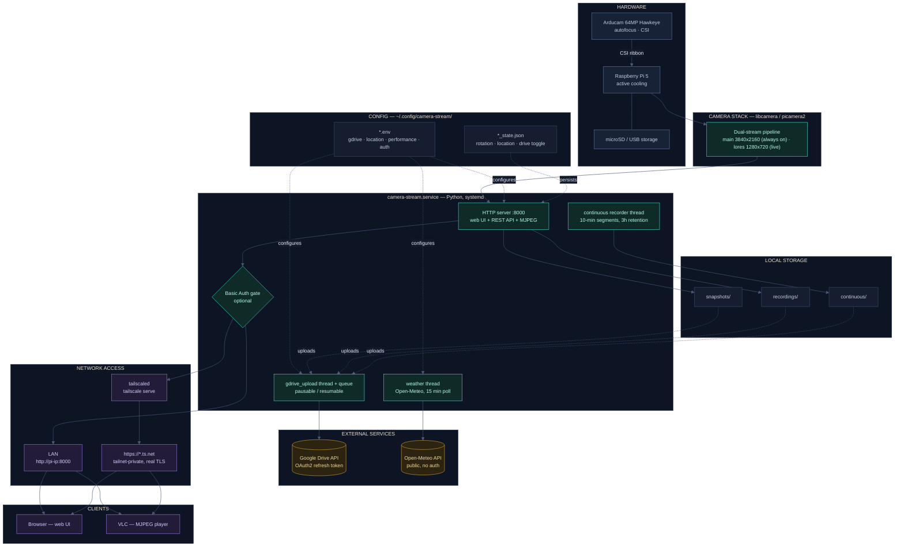

# Architecture

A self-hosted camera system built around a Raspberry Pi 5 and an Arducam 64MP
Hawkeye sensor: live view, on-demand and rolling recording, optional cloud
backup, and private remote access — with no cloud subscription and no vendor
lock-in.

`Raspberry Pi 5 / 4 / Zero 2 W` · `Arducam 64MP Hawkeye (CSI)` · `picamera2 + libcamera` ·
`Python http.server` · `systemd user service` · `HTTP Basic Auth (optional)` ·
`Google Drive backup (optional)` · `Tailscale (private remote access)`

## System diagram

**Legend**: 🔷 Hardware · 🟢 Core application · ⬛ Storage & config · 🟡 External services · 🟣 Network & clients

## Layer notes

### Hardware
Arducam 64MP Hawkeye over CSI — autofocus, 9248×6944 native. Board choice is read
from the sensor at runtime, not hardcoded, so a Camera Module 3, Pi 4, or Zero 2 W
all work without code changes (see [Camera Compatibility](../SETUP.md#camera-compatibility-switching-away-from-the-arducam-64mp)
and [Low-Power Boards](../SETUP.md#low-power-boards-raspberry-pi-zero-2-w) in
SETUP.md). Active cooling matters: sustained encode load holds the Pi in the
55-65°C range.

### Application
`server.py` runs one dual-stream picamera2 pipeline: **main** stays at recording
resolution at all times so 4K capture starts instantly with no mode switch;
**lores** feeds the live MJPEG view and the rolling buffer.

The Basic Auth gate, when enabled, sits in front of every route - the web UI, the
REST API, and the stream itself - checked once per request with a constant-time
comparison.

### Storage & config
Media lives in `snapshots/`, `recordings/`, `continuous/` next to the app. All
four `.env` files are optional and independently togglable - absent means "off,"
not "broken."

Live-adjustable settings (rotation, weather location, Drive pause state) persist
to small JSON files alongside the code, separate from the deploy-time `.env`
config.

### External services
Google Drive backup uploads in the background via a resumable-upload queue,
browsable and deletable from the app itself - no need to open Drive separately.
Weather is a public, unauthenticated Open-Meteo lookup, refreshed every 15
minutes.

### Network access
On the LAN, the stream is reachable directly at `http://pi-ip:8000`. Off the LAN,
`tailscale serve` reverse-proxies the same port to a private `*.ts.net` address
with a real, trusted certificate - reachable only by devices signed into the
tailnet, never the public internet.

Tailscale Funnel (public internet exposure) is supported by the platform but
intentionally not enabled here.
